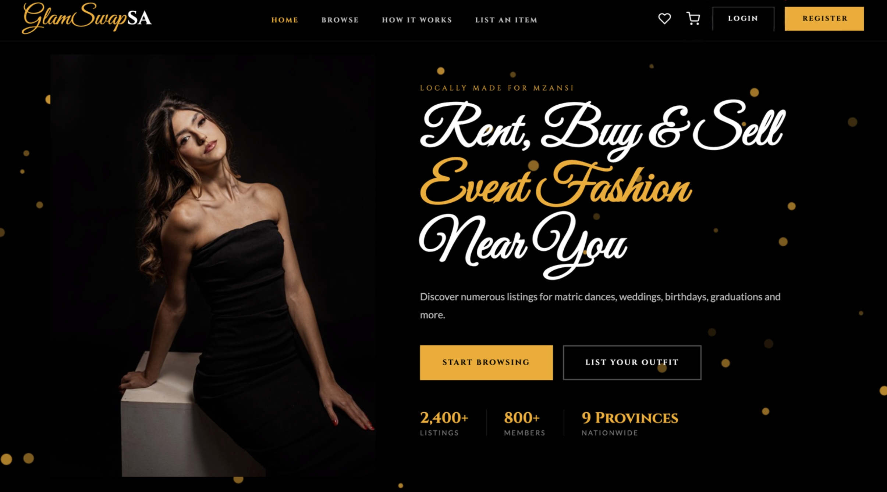
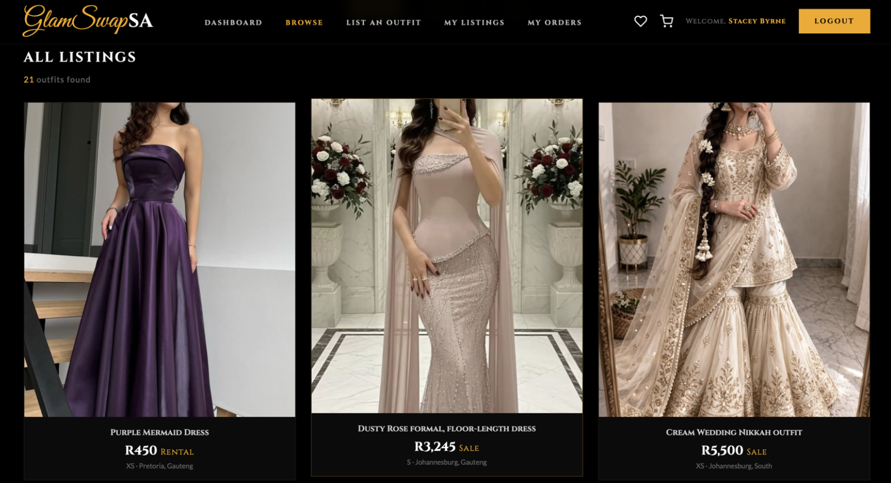
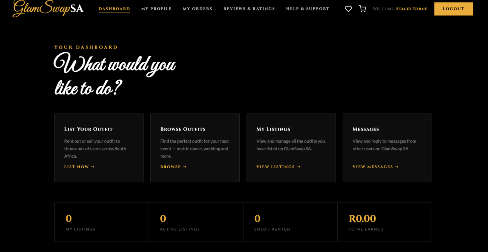
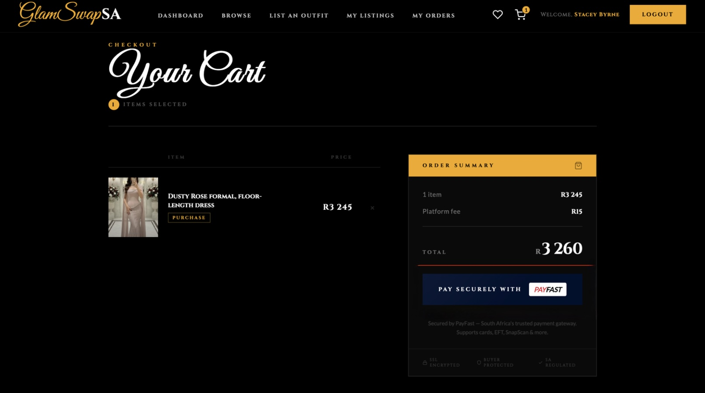
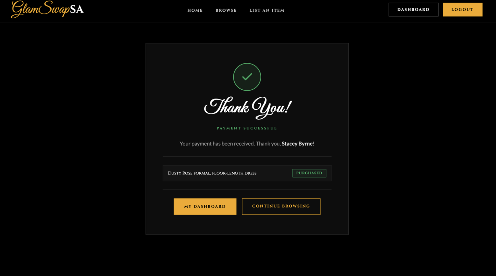

# GlamSwap SA

A consumer-to-consumer fashion marketplace for buying, selling, and renting formal outfits across South Africa — built for matric dances, weddings, and other formal events.

## Overview

GlamSwap SA connects people who want to sell or rent out their formal wear with people looking for outfits for an upcoming event. Built as a full-stack PHP/MySQL web application, with a custom gold/black/cream brand identity.

## Features

- Browse and filter outfit listings by category, price, and location
- Rent, buy, or sell formal wear
- Cart and favourites functionality
- Secure checkout with PayFast sandbox payment integration
- User dashboard with account and order management
- Admin portal for managing users, listings, and reports
- Role-based login with admin redirection
- Live database-driven stats (listings, members, provinces)
- Mobile-responsive layout across all pages

## Screenshots

**Homepage**

Homepage showing the marketplace listings and site navigation.

**Browse Listings**

Browse page showing all active outfit listings with pricing, rental/sale status, size, and location.

**User Dashboard**

Logged-in user dashboard with quick access to listing, browsing, order, and message features, plus live stats for listings and earnings.

**Cart & Checkout**

Cart and order summary page showing item price, platform fee, and total, with secure PayFast checkout integration.

**Payment Confirmation**

Payment confirmation page shown after a successful PayFast transaction, confirming the purchased item.

## Tech Stack

- **Backend:** PHP, MySQL
- **Frontend:** HTML, CSS, JavaScript
- **Payments:** PayFast (sandbox)
- **Hosting:** Hostinger
- **Fonts:** Cinzel, Great Vibes, Lato

## Documentation

The project includes a full user manual, legal terms and conditions, and a branded presentation covering the platform's design and functionality.

## Notes

Built as a full-stack web development and e-commerce project, covering database design, secure payment integration, role-based access control, and responsive UI design. covering database design, secure payment integration, role-based access control, and responsive UI design.
